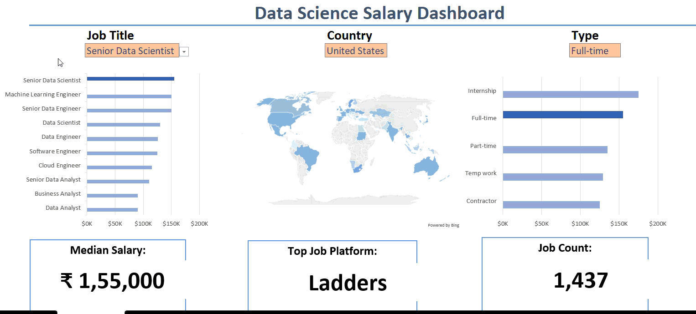
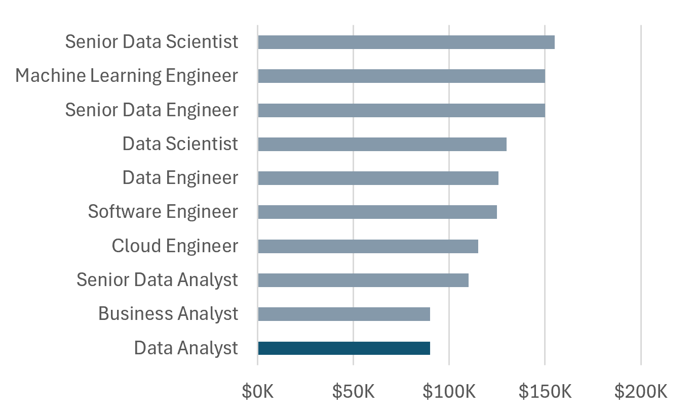
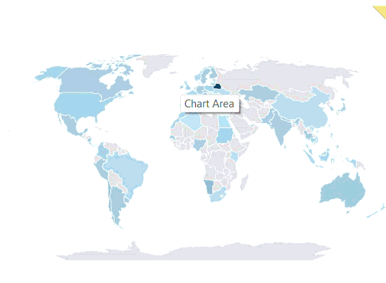

# Data Science Salary Dashboard using Excel
Interactive Excel dashboard analysing Data Science Job Salaries, Job types, and Job platforms with dynamic filters for Job Title, Country, and Employment type.         

  
## Introduction

This data jobs salary dashboard was created to help job seekers investigate salaries for their desired jobs and ensure they are being adequately compensated.


## Dashboard File

My final dashboard is in [Project_1.xlsx](Project_1.xlsx).

## Excel Skills Used

The following Excel skills were utilized for analysis:

- 📊 **Charts**
- 🧮 **Formulas and Functions**
- ✅ **Data Validation**  

  The data set used for this project contains real world data science job information from 2023. It includes detailed information on:

-  💼 **Job Titles**
-  💰 **Salaries**
-  📍 **Locations**
-  🛠️ **Skills**

  ## Dashboard Build
  ## 📈 Charts
  **📊Data Science Job Salaries - Bar Chart**  
  
  
  - 🛠️ **Excel Features:** Utilized bar chart feature (with formatted salary values) and optimized layout for clarity.
- 🎨 **Design Choice:** Horizontal bar chart for visual comparison of median salaries.
- 📂 **Data Organization:** Sorted job titles by descending salary for improved readability.
- 💡 **Insights Gained:** This enables quick identification of salary trends, noting that Senior roles and Engineers are higher-paying than
                           Analyst roles.

**🌍 Country Median Salaries - Map Chart**

  

-🛠️**Excel Features**: Utilized Excel's map chart feature to plot Median Salaries globally.  
-🎨**Design Choice**: Color-Coded map to visually differentiate salary levels across regions.  
-📊**Data Representation**: Plotted Median Salary for each country with available data.  
-👁️**Visual Enhancement**: Improved readability and immediate understanding of geographic salary trends.  
-💡**Insights Gained**: Enables quick grasp of global salary disparities and highlights high/low salary regions.

## 🧮 Formulas and Functions

**💰 Median Salary by Job Titles**  

```excel
=MEDIAN(
    IF(
        (jobs[job_title_short]=A2)*
        (jobs[job_country]=country)*
        (ISNUMBER(SEARCH(type,jobs[job_schedule_type])))*
        (jobs[salary_year_avg]<>0),
        jobs[salary_year_avg]
    )
)
```
-**🔍 Multi-Criteria Filtering**: Checks job title, country, schedule type, and excludes blank salaries.  
-**📊 Array Formula**: Utilizes MEDIAN() function with nested IF() statement to analyse an array.  
-**🎯 Tailored Insights**: Provides specific salary information for job titles, regions, and schedule types.  
-**🔢 Formula Purpose**: This formula populates the table below, returning the median salary based on job title, country, and type.  


  
